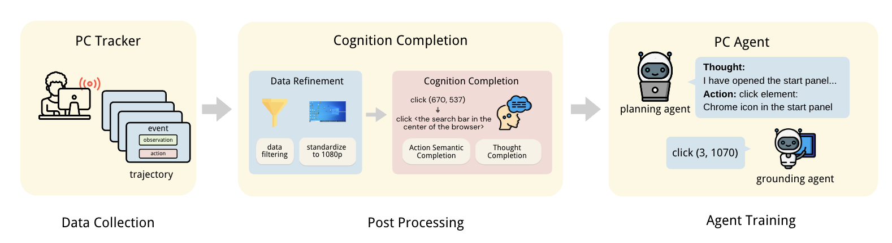

# PC Agent

This is the official repository for 
[PC Agent: While You Sleep, AI Works - A Cognitive Journey into Digital World](https://arxiv.org/)

## Demo

Check out our demo of PC Agent autonomously controlling a computer to complete complex tasks involving dozens of steps!

https://github.com/user-attachments/assets/0ecb5a68-f636-42e0-8f44-e762da61d9e2

## Introduction

**PC Agent** introduces a novel framework to empower autonomous digital agents through **human cognition transfer**. 
This transfer is implemented through three key components: 
1. **PC Tracker**, the first lightweight infrastructure for large-scale human-computer interaction data collection;
2. A **Cognition Completion** postprocess pipeline that transforms raw interaction data into cognitive trajectories;
3. A multi-agent system combining a planning agent for decision-making with a grounding agent for robust visual grounding.

