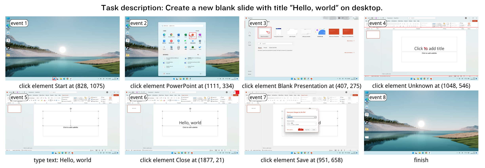

# PC Tracker 用户手册

\[ [English](./README.md) | 中文 \]

- Version: 1.0
- Last updated: 2024-12-20

## 1. 简介

PC Tracker 是一个轻量级工具，用于高效收集大规模真实人机交互轨迹。类似于屏幕录制，PC Tracker在后台无缝运行，自动捕获屏幕截图和键鼠操作。收集到的人机交互轨迹示例如下：

## 2. 安装

- 确保您的电脑是 Windows 操作系统。
- 解压缩我们的软件包到一个磁盘空间足够的位置（用于存储记录数据，推荐 3GB 以上可用空间）。

## 3. 启动

- [可选] 把屏幕分辨率比例设置为 16:9 （推荐 1920 x 1080）。
- 打开解压后的文件夹，启动 main.exe。

## 4. 使用说明

启动软件后，您可选择 **Task Oriented Mode** 或 **Non-Task Oriented Mode** 记录模式。

### Task Oriented Mode

本模式分为 **Given Task** 与 **Free Task** 两种子模式。

#### Given Task

在本模式下，您每次将被分配一个未被完成的任务。

- **下一个任务**：点击 `Next Task` 可获取下一个任务。
- **上一个任务**：点击 `Previous Task` 可返回上一个任务。
- **反馈不佳任务**：如果您认为当前任务难以完成，可点击 `Bad Task` 将其永久丢弃。或者，您也可以先开始执行任务，在完成后根据实际执行情况修改任务描述。
- **开启记录**：点击 `Start`，软件窗口将会自动最小化，此后记录将会开始。
- **结束任务**：完成任务后，点击 `Finish` 保存本次操作过程。如果任务执行失败或您不希望记录本次操作，请点击 `Fail`。
- **修改任务描述**：完成任务后，您可以根据实际执行情况修改任务描述。

#### Free Task

在本模式下，您可以自由地使用电脑，并自行总结任务描述与难度。

- **开启记录**：点击 `Start`，软件页面将会自动最小化，此后记录将会开始。
- **保存并总结记录**：填写任务描述，选择任务难度（easy/medium/hard），然后点击 `Save` 保存记录。
- **丢弃记录**：点击 `Discard` 可丢弃本次记录。

### Non-Task Oriented Mode

在本模式下，您可以自由地使用电脑，任意选择开启与结束记录的时刻。

## 5. 注意事项

- **暂不支持使用扩展屏**。
- **暂不支持使用中文输入法**。
- **暂不支持使用触控板**。
- **软件窗口固定为全屏显示**。为了在后处理中过滤与PC Tracker相关的操作（如点击Start按钮），软件窗口被固定为全屏显示。您可以通过点击重新打开PC Tracker窗口查看任务描述，然后再次最小化，但请不要将其拖动至非全屏状态显示。

## 6. 数据隐私

- 开启记录后，您的屏幕截图与键盘鼠标操作将会被软件自动记录。PC Tracker不会记录任何未被打开的软件的信息。如果您认为本次记录可能会侵犯您的隐私，可选择丢弃本次记录。
- 收集的数据都会被保存在 `./events` 文件夹（默认隐藏）中。我们为每份记录下来的轨迹都提供了Markdown可视化文件。

## 7. 常见问题

**1. 软件是否有联网功能？**

PC Tracker 完全是本地的，不支持联网，不会上传您的数据。

**2. 我的电脑屏幕分辨率不是 16:9，会有什么影响？**

如果您的屏幕分辨率不是 16:9，会对数据的后续统一处理产生影响。我们建议您将屏幕分辨率调整为 16:9。

**3. 收集的数据大概会占用多少空间？**

具体的数据大小视情况而异。一般来说，即使高强度记录操作1小时，也不会产生超过 1GB 的数据量。

## 8. 联系方式

- 如有任何疑问，请通过 henryhe_sjtu@sjtu.edu.cn 或 zizi0123@sjtu.edu.cn 与我们联系。
